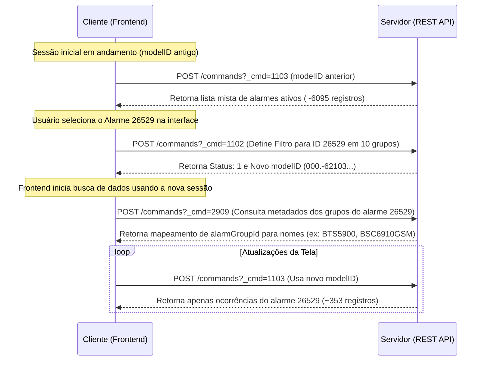

# Relatório de Inspeção HAR: `10.220.50.9.new.har` (Com Filtragem de Alarme Ativa)

Este relatório detalha a inspeção e análise de tráfego gravado no arquivo `10.220.50.9.new.har`. A análise foca em demonstrar o mecanismo exato pelo qual o frontend filtra e exibe alarmes específicos da `lista-alarmes.csv` na tela do sistema.

---

## 1. Visão Geral do Tráfego

* **Total de Requisições Gravadas:** 432
* **Endpoint Principal de APIs:** `https://10.220.50.9:31943/rest/fmwebsite/v1/commands`
* **Método Utilizado:** `POST`
* **Mecanismo de Filtro:** O sistema opera em etapas de comandos (chamados via corpo JSON no parâmetro `cmd`):
  1. **Definição/Alteração de Filtro (`cmd: 1102`)**: Registra os critérios de filtragem e cria uma sessão associada a um `modelID` único no servidor.
  2. **Consulta de Alarmes Filtrados (`cmd: 1103`)**: Usa o `modelID` gerado na etapa anterior para obter repetidamente os dados de alarmes paginados.
  3. **Resolução de Detalhes de Alarme (`cmd: 2909`)**: Chamado para obter informações completas (como nomes amigáveis de grupos de alarmes e severidades padrão) com base no par `alarmId` e `alarmGroupId`.

---

## 2. Fluxo da Filtragem Ativa (Passo a Passo)

Abaixo é descrito o ciclo de vida completo do filtro aplicado neste tráfego, onde a tela foi configurada para exibir especificamente o alarme **"RF Unit VSWR Threshold Crossed" (ID 26529)**.

### Diagrama de Sequência do Fluxo



---

### Passo A: Definição do Filtro na Sessão (`cmd: 1102` - Entrada nº 13)

No momento em que o filtro é aplicado, o frontend faz uma chamada de configuração de filtro enviando a nova condição de busca.

* **Payload do Request:**
  ```json
  {
    "cmd": 1102,
    "parameters": {
      "modelID": "000.125-10984-5572-1724-9391-63-693-94-40-20-936-16114107110-85-521511562-10-126-1-31-8073@260847",
      "bspSessionId": "260847",
      "showStatistic": false,
      "additionalCondition": "{\"alarmGroupId\":{\"operation\":\"in\",\"value\":[]},\"soundInfoCond\":[{\"severity\":1,\"alarmStatus\":\"1\",\"duration\":60},{\"severity\":2,\"alarmStatus\":\"1\",\"duration\":60},{\"severity\":3,\"alarmStatus\":\"1\",\"duration\":60},{\"severity\":4,\"alarmStatus\":\"1\",\"duration\":60}]}",
      "timeMode": 3,
      "urlCondition": null,
      "expression": "",
      "autoRefresh": true,
      "isScrollLock": false,
      "condition": "{\"alarmLevel\":[\"CRITICAL\",\"MAJOR\",\"MINOR\",\"WARNING\"],\"alarmStatus\":[12,10,11,13],\"eventType\":{\"value\":[\"1\",\"2\",\"3\",\"4\",\"5\",\"6\",\"7\",\"8\",\"9\",\"10\",\"11\",\"12\",\"13\",\"14\",\"15\",\"16\"],\"operation\":\"in\"},\"specialAlarmStatus\":{\"value\":[\"0\"],\"operation\":\"in\"},\"alarmGroupId\":{\"operation\":\"in\",\"value\":[{\"alarmId\":\"26529\",\"alarmGroupId\":\"268390521\"},{\"alarmId\":\"26529\",\"alarmGroupId\":\"268390417\"},{\"alarmId\":\"26529\",\"alarmGroupId\":\"268390522\"},{\"alarmId\":\"26529\",\"alarmGroupId\":\"8200\"},{\"alarmId\":\"26529\",\"alarmGroupId\":\"8193\"},{\"alarmId\":\"26529\",\"alarmGroupId\":\"125\"},{\"alarmId\":\"26529\",\"alarmGroupId\":\"268390408\"},{\"alarmId\":\"26529\",\"alarmGroupId\":\"268390540\"},{\"alarmId\":\"26529\",\"alarmGroupId\":\"268390523\"},{\"alarmId\":\"26529\",\"alarmGroupId\":\"268390526\"}]},\"orders\":[{\"field\":\"ColArriveUtc\",\"order\":1}]}"
    }
  }
  ```

> [!IMPORTANT]  
> Note a presença de `alarmGroupId` dentro do objeto `condition`. Ele limita a busca a um conjunto específico de 10 pares de `alarmId` e `alarmGroupId`. Em todos os pares, o `alarmId` é `"26529"`.

* **Resposta do Servidor (`status: 1`):**
  O servidor registra os novos critérios de filtragem e devolve um **novo modelID**:
  `000.-62103-6598-64-41-35490-2811334-67121-98-91-48-1115313594-72-34-103355452-35-120-8643@260847`

---

### Passo B: Resolução de Detalhes dos Grupos (`cmd: 2909` - Entrada nº 373)

O frontend consulta os metadados amigáveis de cada grupo associado ao alarme selecionado para que possa representá-los corretamente na tela do usuário.

* **Payload do Request:**
  O frontend passa a lista dos 10 pares solicitados:
  ```json
  {
    "cmd": 2909,
    "parameters": {
      "selectedAlarms": "[{\"alarmId\":\"26529\",\"alarmGroupId\":\"268390521\"},{\"alarmId\":\"26529\",\"alarmGroupId\":\"268390417\"},{\"alarmId\":\"26529\",\"alarmGroupId\":\"268390522\"},{\"alarmId\":\"26529\",\"alarmGroupId\":\"8200\"},{\"alarmId\":\"26529\",\"alarmGroupId\":\"8193\"},{\"alarmId\":\"26529\",\"alarmGroupId\":\"125\"},{\"alarmId\":\"26529\",\"alarmGroupId\":\"268390408\"},{\"alarmId\":\"26529\",\"alarmGroupId\":\"268390540\"},{\"alarmId\":\"26529\",\"alarmGroupId\":\"268390523\"},{\"alarmId\":\"26529\",\"alarmGroupId\":\"268390526\"}]",
      "noUseRedefinedName": false
    }
  }
  ```

* **Resposta do Servidor (Mapeamento de Grupos):**
  Retorna o nome técnico (`alarmGroupName`) de cada grupo:
  
  | ID do Alarme | ID do Grupo (`alarmGroupId`) | Nome do Grupo (`alarmGroupName`) | Nome do Alarme no Sistema |
  | :--- | :--- | :--- | :--- |
  | **26529** | 125 | `BTS3900 WCDMA` | RF Unit VSWR Threshold Crossed |
  | **26529** | 268390408 | `BSC6910GSM` | RF Unit VSWR Threshold Crossed |
  | **26529** | 268390417 | `BTS3900` | RF Unit VSWR Threshold Crossed |
  | **26529** | 268390521 | `BTS5900` | RF Unit VSWR Threshold Crossed |
  | **26529** | 268390522 | `BTS5900 LTE` | RF Unit VSWR Threshold Crossed |
  | **26529** | 268390523 | `BTS5900 WCDMA` | RF Unit VSWR Threshold Crossed |
  | **26529** | 268390526 | `BTS5900 5G` | RF Unit VSWR Threshold Crossed |
  | **26529** | 268390540 | `BTS3900 5G` | RF Unit VSWR Threshold Crossed |
  | **26529** | 8193 | `GBTS` | RF Unit VSWR Threshold Crossed |
  | **26529** | 8200 | `BTS3900 LTE` | RF Unit VSWR Threshold Crossed |

---

### Passo C: Obtenção dos Dados dos Alarmes (`cmd: 1103` - Entradas nº 260, 317, 428)

Nas chamadas subsequentes de busca de dados, o frontend faz a paginação usando o novo `modelID` correspondente à sessão filtrada.

* **Payload do Request (Exemplo na Entrada nº 260):**
  ```json
  {
    "cmd": 1103,
    "parameters": {
      "modelID": "000.-62103-6598-64-41-35490-2811334-67121-98-91-48-1115313594-72-34-103355452-35-120-8643@260847",
      "timeMode": 3,
      "versionFlag": false,
      "csns": [],
      "autoRefresh": true,
      "scrollLock": false,
      "from": 1,
      "to": 148
    }
  }
  ```

* **Estrutura da Resposta:**
  Diferentemente da sessão inicial que continha mais de 6000 alarmes mistos, a resposta para este `modelID` específico retorna **apenas 353 alarmes no total** (em vez de 6000+), e todos eles contêm exclusivamente `"alarmId": "26529"` no array `parameters.data`.
  
  ```json
  {
    "parameters": {
      "total": 353,
      "data": [
        {
          "csn": 406709829,
          "arriveUtc": "2026-06-24 15:45:03",
          "alarmId": "26529",
          "alarmGroupId": "268390521",
          "alarmName": "RF Unit VSWR Threshold Crossed",
          "severity": 3,
          "meName": "SR-UWCTJ1",
          "address": "10.232.252.221",
          "meType": "RanCnNetworkElement",
          "arriveUtc": "2026-06-24 15:45:03"
        },
        ...
      ]
    }
  }
  ```

---

## 3. Conclusão da Inspeção

O arquivo `10.220.50.9.new.har` representa uma sessão onde a tela foi explicitamente filtrada para exibir o alarme **"RF Unit VSWR Threshold Crossed" (ID 26529)**. 

O frontend executa a filtragem definindo as condições pelo comando `cmd: 1102`, que gera uma nova chave de visualização (`modelID`). Com essa chave, todas as requisições posteriores feitas via `cmd: 1103` recebem dados já refinados e processados diretamente do backend, sem a necessidade de realizar a filtragem dos milhares de alarmes ativos no próprio navegador (frontend).
