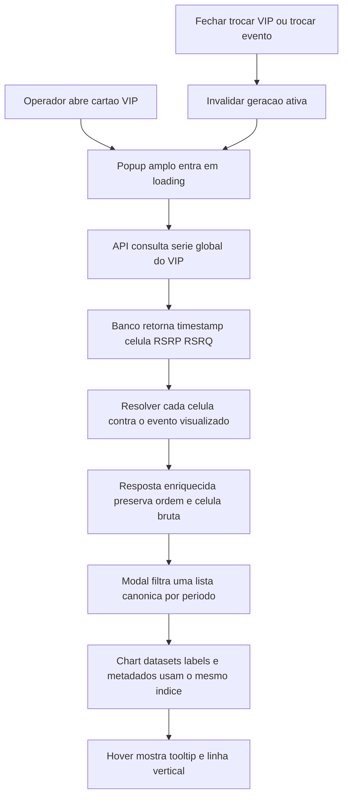

# Melhoria do Popup Analitico de VIP - Plan

## Goal Capsule

- **Objetivo:** transformar o popup de detalhe do VIP em uma visão analítica ampla, legível e contextual, com o estado atual preservado acima de um gráfico que identifica site e célula em cada instante.
- **Autoridade de produto:** as decisões confirmadas nesta conversa prevalecem sobre preferências de implementação; o código existente define os contratos de dados e os padrões visuais a reutilizar.
- **Perfil de execução:** uma fase única, composta por três unidades dependentes, porque API, modal e testes entregam um único fluxo útil e não exigem migração ou rollout separado.
- **Bloqueadores abertos:** nenhum.
- **Condição de parada:** interromper e reavaliar se a implementação exigir mudar o schema de `vip_measurements`, a coleta FARS ou o comportamento geral do gráfico de KPIs.

---

## Product Contract

### Summary

O detalhe do VIP abrirá diretamente em um popup analítico com as dimensões do popup detalhado de sites, usando uma hierarquia equilibrada: resumo atual compacto no topo, controles temporais próximos ao gráfico e série histórica ocupando o espaço restante.
Cada instante apontado no gráfico mostrará data e hora, site, célula, RSRP e RSRQ, acompanhado por uma linha vertical pontilhada e semitransparente.

### Problem Frame

O popup atual concentra cinco cartões de dados em uma área de 660 px e reserva apenas 200 px de altura ao gráfico.
Isso reduz a leitura da tendência, faz os dados parecerem amontoados e não permite identificar o site correspondente a uma medição histórica.
Embora a série já transporte a célula servidora, o site só é resolvido para a medição mais recente, e o tooltip atual mostra somente tempo, RSRP e RSRQ.

### Requirements

**Estrutura e hierarquia**

- R1. O popup de detalhe do VIP deve abrir por padrão com aproximadamente 80% da largura e da altura disponíveis, limitado a 90% da viewport, seguindo o padrão visual do popup detalhado de KPIs.
- R2. O cabeçalho deve identificar o VIP, sua função quando disponível, o status e o último registro sem competir visualmente com o gráfico.
- R3. Uma faixa compacta deve mostrar site atual, célula atual, RSRP e RSRQ, com tratamento previsível para valores ausentes e textos longos.
- R4. O gráfico deve ocupar o espaço flexível restante do popup; não haverá botão nem segundo modo de expansão.
- R5. O layout deve continuar utilizável em viewports estreitas ou baixas, reorganizando o resumo, preservando os controles e evitando overflow da página.

**Contexto histórico e interação**

- R6. Cada ponto da série deve carregar o site resolvido no contexto do evento visualizado, sem persistir o nome do site na medição global.
- R7. O tooltip deve usar o índice concreto do ponto apontado e exibir data e hora com segundos, site, célula, RSRP e RSRQ do mesmo registro.
- R8. Quando a célula histórica não pertencer aos sites do evento, o tooltip deve preservar a célula bruta e indicar que o site não foi identificado, sem herdar o site atual do VIP.
- R9. Uma linha vertical pontilhada e semitransparente deve acompanhar o ponto ativo dentro da área do gráfico e desaparecer quando não houver hover ativo.
- R10. As janelas Hoje, 3 dias, 7 dias e Total devem continuar funcionando sobre a série em cache e atualizar gráfico, tooltip e linha-guia sem acumular instâncias ou listeners.

**Estados e ciclo de vida**

- R11. Ao abrir ou trocar o VIP, o popup deve limpar conteúdo visual obsoleto, comunicar carregamento e impedir que uma resposta atrasada substitua os dados do VIP atualmente aberto.
- R12. Histórico vazio e falha ao buscar a série devem ter estados distintos, sem reaproveitar silenciosamente o gráfico anterior.
- R13. Os fechamentos existentes por botão e backdrop devem ser preservados; o popup ampliado também deve expor semântica de diálogo, fechamento por Escape e restauração de foco ao cartão que o abriu.
- R14. Trocar o evento ativo ou histórico enquanto o popup estiver aberto deve invalidar o conteúdo e fechar o popup, pois a associação entre célula e site depende do evento visualizado.

### Key Decisions

- **Hierarquia equilibrada.** (session-settled: user-directed — chosen over graph-first and investigation-side-panel layouts: it preserves immediate signal context while giving the chart clear visual dominance.) Governs R2, R3, R4.
- **Popup amplo desde a abertura.** (session-settled: user-approved — chosen over a compact popup with a separate expand action: one analytical view avoids duplicated modes and reuses a familiar product pattern.) Governs R1, R4.
- **Resumo atual permanece visível.** (session-settled: user-approved — chosen over a chart-only expanded view: site, cell and current signal remain available as orientation.) Governs R2, R3.

### Acceptance Examples

- AE1. **Given** um VIP com histórico, **when** o operador abre seu detalhe, **then** o popup ocupa aproximadamente 80% da viewport, mostra o resumo atual em uma única faixa e usa o restante para o gráfico.
- AE2. **Given** uma série em que o VIP passa por dois sites, **when** o operador aponta pontos antes e depois da troca, **then** cada tooltip mostra o site e a célula daquele próprio registro.
- AE3. **Given** uma medição com célula não mapeada, **when** o operador aponta o ponto, **then** a célula continua visível e o site aparece como não identificado.
- AE4. **Given** dois registros com o mesmo timestamp ou um registro com uma métrica nula, **when** o operador aponta cada índice, **then** os metadados permanecem alinhados ao registro e nenhum campo mostra `undefined`.
- AE5. **Given** uma janela temporal sem registros, **when** ela é selecionada, **then** o popup mostra o estado vazio daquela janela e não mantém um gráfico anterior.
- AE6. **Given** uma requisição lenta para o VIP A seguida da abertura do VIP B, **when** A responde por último, **then** seus dados não substituem o conteúdo de B.
- AE7. **Given** o popup aberto em viewport estreita, **when** o resumo e os filtros reorganizam, **then** fechar, ler os valores, mudar o período e usar o gráfico continuam possíveis sem overflow horizontal da página.

### Success Criteria

- O gráfico é a área dominante do popup em desktop e permanece utilizável em notebook e viewport estreita.
- O operador identifica site, célula e métricas de qualquer instante em uma única interação de hover.
- A associação histórica muda ponto a ponto quando o VIP se desloca e nunca usa o site atual como fallback incorreto.
- Todos os cenários novos de API e navegador passam de forma determinística sem VPN.
- A suíte completa não adquire falhas novas; falhas já registradas são reportadas separadamente.

### Scope Boundaries

**In scope**

- Enriquecimento da resposta de série VIP com site resolvido em tempo de consulta.
- Reorganização do markup e dos estilos do popup VIP.
- Tooltip contextual, linha vertical de hover, estados assíncronos e acessibilidade do popup.
- Mocks determinísticos e cobertura automatizada de API e interface.

**Out of scope**

- Alterar o schema, migrar dados ou persistir `serving_site`/`serving_site_name` em `vip_measurements`.
- Alterar o coletor, o decode RRC/FARS, thresholds ou a frequência de coleta.
- Refatorar de forma geral `frontend/js/kpi.js` ou mudar o comportamento do popup de KPIs.
- Alterar a tela de cadastro e associação de VIPs.
- Criar painel lateral persistente de investigação ou segundo nível de expansão.

#### Deferred to Follow-Up Work

- Tornar “Total” literalmente ilimitado. Nesta entrega será preservado o limite atual da consulta ampla para não misturar a melhoria visual com mudança de retenção/consulta histórica.
- Consolidar todos os modais da aplicação em um componente visual compartilhado.

### Dependencies

- A configuração do evento precisa continuar fornecendo sites, células e `obj_no` para a resolução contextual.
- `Chart.js` e `chartjs-plugin-annotation` permanecem vendored e carregados localmente; nenhuma dependência nova é necessária.
- O Chromium do Playwright é necessário apenas para executar a cobertura visual automatizada.

---

## Planning Contract

### Key Technical Decisions

- KTD1. **Resolver o site histórico na API em tempo de consulta.** Extrair a regra hoje embutida em `get_vips` para um helper reutilizado por `get_vips` e `get_vip_series`; isso mantém estado atual e histórico consistentes, preserva a natureza global das medições VIP e evita mudança de schema. Governs R6, R8.
- KTD2. **Usar um array canônico de registros filtrados.** Labels, datasets, tooltip, divisores de dia e linha de hover devem derivar do mesmo `dataIndex`, sem mapas por timestamp nem filtros independentes por métrica. Isso preserva registros com timestamps iguais e valores nulos. Governs R7, R9, R10.
- KTD3. **Desenhar a linha-guia com um plugin local do gráfico VIP.** Um plugin Chart.js escopado ao modal desenha a linha em `afterDraw` a partir do elemento ativo, limitado a `chartArea`; annotations continuam responsáveis apenas por thresholds e divisores estáticos. Governs R9, R10.
- KTD4. **Reutilizar o padrão dimensional, não o estado do popup KPI.** O popup VIP adota a geometria flexível de `.popup-chart-box`, mas conserva markup, canvas, ciclo de vida e estado próprios para evitar acoplamento entre `vip.js` e `kpi.js`. Governs R1, R4, R5.
- KTD5. **Invalidar requisições por geração.** Cada abertura/fechamento/troca de evento avança um token local; somente a resposta da geração ativa pode renderizar. A identidade do objeto VIP, sozinha, não cobre fechar e reabrir rapidamente o mesmo VIP. Governs R11, R12, R14.
- KTD6. **Entregar em uma fase única.** API, popup e testes não geram valor independente suficiente para justificar rollout parcial, e todos reutilizam infraestrutura existente sem migração. Governs R1-R14.

### High-Level Technical Design

### Implementation Constraints

- Preservar a separação atual entre módulos frontend: `vip.js` não deve importar nem controlar `kpi.js`; coordenação global continua pelo `State`.
- Não introduzir dependência externa nem exigir rede para renderizar o popup.
- Não usar o campo persistido `in_event` como fonte do site histórico; a referência é a configuração do evento atualmente visualizado.
- Manter a célula original no payload mesmo quando nenhuma correspondência de site for encontrada.
- Destruir a instância anterior do Chart.js antes de recriar o gráfico e não registrar plugins/listeners cumulativos ao trocar período.
- Preservar o comportamento atual das janelas temporais, inclusive o alcance atual de “Total”, que está explicitamente fora desta mudança.

### Sequencing

1. Estabilizar o contrato enriquecido da série VIP e seus testes de API.
2. Reorganizar o popup e ligar tooltip/linha-guia aos novos metadados por índice.
3. Tornar os mocks determinísticos e fechar a cobertura browser/responsiva do fluxo completo.

### Risks and Mitigations

- **Divergência entre site atual e histórico:** uma regra duplicada produziria resultados diferentes; mitigar com helper único e testes do mesmo conjunto de casos nos dois endpoints.
- **Metadados desalinhados do gráfico:** timestamps repetidos e métricas nulas quebram mapas ou arrays filtrados separadamente; mitigar usando o `dataIndex` sobre um único array canônico.
- **Resposta assíncrona obsoleta:** abrir outro VIP ou trocar de evento pode renderizar dados antigos; mitigar com token de geração e limpeza imediata do gráfico.
- **Regressão de layout em tela baixa:** dimensões percentuais podem cortar controles; mitigar com composição flex, `min-height: 0`, resumo quebrável e scroll interno somente quando necessário.
- **Teste frágil de canvas:** comparar pixels exatos torna a suíte instável; testar tooltip e estado ativo semanticamente, mantendo a inspeção da linha pontilhada na validação visual.

### Sources and Research

- `frontend/index.html` — markup atual do modal VIP e do popup detalhado de KPIs.
- `frontend/css/main.css` — dimensões, animação e containers flexíveis do popup KPI.
- `frontend/js/vip.js` — ciclo de vida, cache temporal, Chart.js, thresholds e tooltip atuais.
- `frontend/js/kpi.js` — padrão local de gráfico em popup sem acoplar o novo fluxo ao módulo.
- `frontend/js/bridge.js` — dados mockados e contrato de série usado no desenvolvimento offline.
- `api/api.py` — resolução atual de célula para site no status do VIP e passthrough atual da série.
- `core/database.py` — persistência global e campos já retornados por `get_vip_series`.
- `tests/test_frontend_collection_ui.py` — padrão de servidor temporário e Playwright headless.
- `MEMORY.md` — evidência de mobilidade de um VIP entre múltiplas células/sites e falhas preexistentes conhecidas.
- `ERRORS.md` — aprendizado sobre precisão e ordenação dos timestamps FARS.

---

## Single-Phase Delivery

Esta entrega será feita em uma única fase porque o dado-base já existe, o padrão de popup amplo já está implementado e não há migração ou alteração de coleta.
A fase entrega o contrato histórico enriquecido, a nova composição visual, a interação contextual e a prova automatizada como uma única mudança funcional.

### Detailed Scope

**Codigo**

- Compartilhar a resolução célula-site entre o estado atual e a série histórica na API.
- Enriquecer cada registro da série com `serving_site` e `serving_site_name`, preservando os demais campos e a ordem.
- Substituir dimensões inline do modal por classes específicas e layout flexível.
- Usar o ponto ativo do Chart.js para compor tooltip e linha-guia.
- Proteger o modal contra respostas tardias e invalidar o conteúdo quando o evento mudar.

**Interface**

- Abrir diretamente no tamanho analítico do popup de site.
- Exibir identidade e estado atual em uma faixa compacta acima do gráfico.
- Manter períodos e legenda próximos à área plotada.
- Mostrar site, célula e métricas no hover, com fallback claro para site desconhecido.
- Tratar loading, vazio e erro sem exibir dados obsoletos.
- Reorganizar o resumo em telas estreitas e preservar navegação por teclado.

**Testes**

- Cobrir o enriquecimento da API em correspondências exatas, por `obj_no`, por inferência numérica e sem correspondência.
- Usar série mockada determinística com troca de site/célula, célula desconhecida, timestamp duplicado, métrica nula, vazio, erro e resposta atrasada.
- Verificar abertura, dimensões, resumo, filtros, tooltip, ciclo da linha-guia, fechamento, foco e responsividade no navegador.
- Executar a suíte offline completa e separar falhas preexistentes de regressões desta entrega.

---

## Implementation Units

### U1. Enrich historical VIP series with event site context

- **Goal:** garantir que cada medição histórica entregue ao frontend contenha a associação célula-site válida para o evento visualizado.
- **Requirements:** R6, R8; covers AE2, AE3, AE4.
- **Dependencies:** nenhuma.
- **Files:**
  - `api/api.py`
  - `tests/test_api.py`
- **Approach:**
  1. Extrair de `get_vips` a construção do índice de células/`obj_no` e a resolução por igualdade, prefixo/substring e inferência ECI/NCI.
  2. Reutilizar o helper em `get_vips` para preservar o comportamento corrente.
  3. Em `get_vip_series`, carregar o evento solicitado, resolver cada `serving_cell` e anexar ID/nome do site sem filtrar ou reordenar a série.
  4. Devolver site nulo para célula não reconhecida, mantendo a célula e as métricas originais.
- **Patterns to follow:** resolução em tempo de consulta de `Api.get_vips`; enriquecimento de linhas feito por `Api.get_alarms`; banco global documentado em `core/database.py`.
- **Test scenarios:**
  1. Covers AE2. Uma série com células de dois sites retorna `serving_site` e `serving_site_name` próprios em cada registro.
  2. Célula com ID exato, célula representada por `obj_no` e identificador global numérico usam as regras já aceitas pelo status atual.
  3. Covers AE3. Uma célula desconhecida retorna site nulo, preservando `serving_cell`, timestamp, RSRP e RSRQ.
  4. Covers AE4. Dois registros com o mesmo timestamp permanecem na resposta, em sua ordem de origem, com metadados independentes.
  5. Uma mesma série global consultada contra eventos com mapas diferentes recebe a resolução correspondente ao evento solicitado.
  6. Evento inexistente ou sem sites devolve a série sem associação de site, sem falhar e sem inventar pertencimento.
- **Verification:** os testes provam paridade do status atual após a extração e enriquecimento ponto a ponto sem mudança no banco.

### U2. Build the wide VIP analytics popup

- **Goal:** aplicar a hierarquia equilibrada no popup amplo e tornar a leitura histórica contextual, responsiva e segura durante operações assíncronas.
- **Requirements:** R1-R5, R7, R9-R14; covers AE1, AE4-AE7.
- **Dependencies:** U1.
- **Files:**
  - `frontend/index.html`
  - `frontend/css/main.css`
  - `frontend/js/vip.js`
  - `tests/test_frontend_vip_modal_ui.py`
- **Approach:**
  1. Reestruturar o markup em cabeçalho, faixa de resumo, toolbar temporal e região flexível de gráfico/estados, removendo as dimensões inline de 660 px e 200 px.
  2. Reutilizar a geometria do popup KPI e adicionar estilos VIP específicos para faixa compacta, truncamento/quebra controlada, viewport baixa e layout estreito.
  3. Tornar o modal um diálogo nomeado, controlar foco, Escape e restauração ao cartão de origem, preservando os fechamentos existentes.
  4. Manter um array canônico da janela selecionada e derivar dele labels, RSRP, RSRQ, tooltip, divisores e metadados pelo mesmo índice.
  5. Acrescentar ao tooltip data/hora, site, célula e as duas métricas, usando `—` para valor ausente e mensagem explícita para site desconhecido.
  6. Registrar uma única implementação local da linha-guia, desenhada somente com ponto ativo e removida visualmente em `mouseout`.
  7. Introduzir geração de requisição e estados loading/vazio/erro; fechar e invalidar o modal na troca de evento.
- **Execution note:** validar primeiro o markup e os estados com dados mockados; depois ligar o canvas e o hover, reduzindo a chance de um canvas visualmente correto esconder transições quebradas.
- **Patterns to follow:** `.popup-chart-box` e `#popup-chart-container` em `frontend/css/main.css`; lifecycle e `_syncWindowTabs` em `frontend/js/vip.js`; eventos globais em `frontend/js/state.js`.
- **Test scenarios:**
  1. Covers AE1. Clicar em um cartão abre o diálogo, cuja caixa mede aproximadamente 80% da viewport e contém resumo e gráfico visíveis.
  2. Resumo com função/site/célula longos não sobrepõe fechar, métricas ou filtros; valores ausentes aparecem como `—`.
  3. Hoje, 3 dias, 7 dias e Total alteram o conjunto visível e mantêm uma única instância funcional do tooltip/linha-guia.
  4. Covers AE2-AE4. Hover em pontos determinísticos exibe data/hora, site, célula e métricas do mesmo índice; timestamp repetido e métrica nula não deslocam metadados nem mostram `undefined`.
  5. A linha-guia fica confinada ao gráfico, acompanha o ponto ativo e some quando o ponteiro sai.
  6. Covers AE5. Janela vazia remove o canvas visível e apresenta o estado vazio daquela seleção.
  7. Falha da API apresenta estado de erro; uma nova tentativa bem-sucedida substitui o erro sem recriar conteúdo obsoleto.
  8. Covers AE6. Abrir A e depois B, fechar durante a carga ou trocar o evento impede a resposta antiga de renderizar.
  9. Botão, backdrop e Escape fecham; clique interno não fecha; foco retorna ao cartão de origem; períodos expõem estado ativo acessível.
- **Verification:** o fluxo pode ser operado por mouse e teclado, sem erro no console, vazamento de gráfico ou conteúdo de outro VIP/evento.

### U3. Add deterministic browser fixtures and regression coverage

- **Goal:** tornar o novo comportamento reproduzível sem VPN e provar layout, interação e regressões nos breakpoints relevantes.
- **Requirements:** R1-R14; covers AE1-AE7.
- **Dependencies:** U1, U2.
- **Files:**
  - `frontend/js/bridge.js`
  - `tests/test_frontend_vip_modal_ui.py`
  - `tests/test_database.py`
- **Approach:**
  1. Substituir a aleatoriedade relevante da série mock por uma sequência determinística que atravesse ao menos dois sites, contenha célula não mapeada, timestamp duplicado e métrica nula.
  2. Adicionar cenários selecionáveis para histórico vazio, erro e respostas com atrasos diferentes, preservando o mock padrão das demais telas.
  3. Reutilizar o servidor temporário, `pytest.importorskip` e o skip de Chromium ausente do teste frontend já existente.
  4. Cobrir estrutura e comportamento no DOM/Chart.js; evitar comparação rígida de pixels do canvas.
  5. Preservar a cobertura do banco que comprova `serving_cell` sem adicionar responsabilidades de site à camada de persistência.
- **Patterns to follow:** `_frontend_server` e lifecycle do navegador em `tests/test_frontend_collection_ui.py`; cenários via query string em `frontend/js/bridge.js`.
- **Test scenarios:**
  1. A fixture determinística reproduz troca de site, célula desconhecida, timestamp igual e valor nulo em execuções sucessivas.
  2. Em 1366×768 e 1024×768, o popup mantém cabeçalho, resumo, filtros e gráfico sem corte ou overflow da página.
  3. Covers AE7. Em aproximadamente 390×844, o resumo reorganiza, textos longos têm tratamento intencional e o gráfico mantém área utilizável.
  4. Empty/error/delay scenarios exercitam os estados e a proteção contra resposta tardia sem depender de PyWebView ou VPN.
  5. O teste de persistência continua demonstrando que célula e medições atravessam `get_vip_series` sem exigir colunas novas.
- **Verification:** os testes browser são repetíveis, não dependem de dados randômicos e falham por regressões semânticas, não por pequenas diferenças de rasterização.

---

## Verification Contract

### Automated Tests

| Gate | Command | Proves |
|---|---|---|
| API e persistência direcionadas | `.venv\Scripts\python.exe -m pytest tests/test_api.py tests/test_database.py -v` | Enriquecimento por evento, fallback desconhecido e preservação dos registros do banco |
| Popup VIP no navegador | `.venv\Scripts\python.exe -m pytest tests/test_frontend_vip_modal_ui.py -v` | Layout, estados, hover, períodos, concorrência, fechamento e responsividade |
| Regressão frontend existente | `.venv\Scripts\python.exe -m pytest tests/test_frontend_collection_ui.py -v` | O novo CSS/modal não quebra o popup de status de coleta |
| Suíte offline completa | `.venv\Scripts\python.exe -m pytest tests/ -v` | Ausência de regressões fora do fluxo alterado; testes `vpn` são pulados sem `--vpn` |

Se o Chromium não estiver instalado, executar `.venv\Scripts\playwright.exe install chromium` antes do gate browser.
As falhas preexistentes registradas em `MEMORY.md` — dois casos de `TestMockCollectAlarms` e `test_resolve_base_url_pelo_catalogo` — devem ser comparadas com o baseline do HEAD e reportadas separadamente; nenhuma falha nova é aceitável.

### Visual Validation

1. Executar o frontend no modo mock pelo navegador ou iniciar `python main.py --mock --dev`.
2. Abrir um VIP e confirmar que o popup usa aproximadamente 80% da tela, sem botão de expansão, com resumo compacto e gráfico dominante.
3. Conferir 1366×768, 1024×768 e aproximadamente 390×844: sem overflow horizontal, botão fechar e filtros acessíveis, textos longos controlados e gráfico legível.
4. Apontar registros antes/depois de uma troca de site e a célula desconhecida; confirmar o conteúdo do tooltip e que a linha vertical acompanha exatamente o ponto ativo com opacidade discreta.
5. Sair do gráfico, trocar os quatro períodos e reabrir o mesmo VIP; confirmar que a linha some, não duplica e o tooltip permanece alinhado.
6. Exercitar histórico vazio, erro e troca rápida entre VIPs/eventos; confirmar que nenhum gráfico ou site obsoleto reaparece.
7. Navegar apenas pelo teclado: abrir, mudar período, fechar por Escape e confirmar a restauração de foco.

---

## Definition of Done

- U1 está concluída quando estado atual e histórico usam a mesma resolução de site e todos os registros mantêm sua célula e métricas originais.
- U2 está concluída quando o popup amplo corresponde à hierarquia aprovada, o hover identifica o instante completo e todos os estados/ciclos de vida são seguros.
- U3 está concluída quando os cenários determinísticos cobrem mobilidade, desconhecido, nulos, concorrência e breakpoints sem VPN.
- Os quatro gates automatizados aplicáveis passam, descontando apenas falhas preexistentes reproduzidas no baseline e documentadas no resultado.
- A validação visual confirma a linha pontilhada, densidade, responsividade e navegação por teclado.
- Nenhuma alteração de schema, coleta ou refatoração geral do KPI aparece no diff.
- Código experimental ou tentativas abandonadas são removidos antes da entrega.

---

## Suggested Commit

`feat: improve VIP detail popup`
