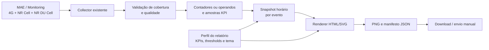

# Plano de implementação — relatórios horários de performance

**Data:** 2026-08-17  
**Status:** proposta para validação  
**Objetivo:** gerar automaticamente uma imagem de Performance Dashboard por hora, a partir dos dados coletados pelo Smart Events/MAE, para revisão e compartilhamento manual pelo engenheiro.

## Decisão recomendada

Implementar o relatório de forma nativa no Smart Events. A planilha com macro e o MAOS devem ser usados como fontes de comparação e validação, não como dependências permanentes do produto.

O envio por WhatsApp não pertence ao MVP. O primeiro resultado será um PNG salvo localmente, com geração manual e automática, pronto para o operador encaminhar.

## Escopo visual

O relatório seguirá o padrão dos exemplos usados pelo time:

- Cabeçalho temático por evento: banner, logo, cores e nome do evento.
- Seção de monitoramento 5G.
- Seção de monitoramento 4G.
- Velocímetros para throughput, PRB e interferência.
- Gráficos de barras para as três últimas horas fechadas.
- Cards de saúde com semáforo por KPI.
- Tabela de KPIs VoLTE quando configurada.
- Rodapé com marca do cliente e metadados mínimos de auditoria.

O layout deve ser modular: indicadores ausentes não devem aparecer como zero; devem ser ocultados ou apresentados como `—`, conforme a configuração do perfil.

## Estado atual aproveitável

- Coleta de KPIs a cada 120 segundos pelo scheduler.
- Persistência de medições por evento, site, célula, timestamp, tecnologia e escopo.
- Fórmulas existentes para KPIs 4G, 5G NR Cell e 5G NR DU Cell.
- Agregação por site, calculada com contadores do mesmo timestamp para evitar média incorreta de percentuais.
- Histórico temporal e suporte a eventos 4G, 5G e mistos.

## Lacunas identificadas

### Dados e fórmulas

Os seguintes indicadores ainda precisam de fonte, fórmula e regra de agregação validadas antes de constarem em um relatório de produção:

- 4G: handover, CSFB, transmission e KPIs VoLTE.
- 5G: usuários separados entre SA e NSA, Reassembly Fail Rate, TX Drop, Delta VQI, Frag. TX Packets, Intra/Inter-sgNB PSCell e transmission.
- Volume 4G/5G: unidade e conversão para GB.
- Throughput 5G: unidade e fórmula de produção.

Um dashboard 5G completo requer as tasks de **NR Cell** e **NR DU Cell**. Eventos configurados somente com NR DU Cell não possuem todos os indicadores de acessibilidade, drop, availability e usuários.

### Agregação horária

Não é seguro gerar um KPI horário apenas calculando a média dos valores de KPI já persistidos:

- acessibilidade, drop, availability e PRB dependem de numeradores e denominadores;
- usuários precisam de média temporal e soma entre células;
- volume precisa de soma temporal e espacial;
- throughput precisa de regra temporal validada.

O produto deve persistir os contadores brutos necessários, ou operandos normalizados (numerador, denominador, período e unidade), para recalcular os KPIs no escopo `EVENT/HOUR`.

## Arquitetura proposta

### Novos componentes

1. `ReportProfile`
   - Tema, banner, logo, paleta, ordem dos blocos e dimensões da imagem.
   - Lista de KPIs por tecnologia, unidades e regras de exibição.
   - Thresholds e direção do indicador: quanto maior melhor, quanto menor melhor ou faixa aceitável.
   - Timezone, atraso esperado de publicação e cobertura mínima.

2. Persistência de operandos e snapshots
   - Tabela de operandos/contadores necessários para o cálculo confiável.
   - Tabela `report_runs` com evento, período, status, cobertura, hashes, caminho do PNG, caminho do JSON, versão da fórmula e versão do template.
   - Chave única por `(event_id, period_start, template_version)` para idempotência.

3. `HourlyReportBuilder`
   - Seleciona dados da hora fechada.
   - Recalcula cada KPI com a regra correta.
   - Produz valores, séries de três horas, cobertura, freshness e status de qualidade.

4. `ReportRenderer`
   - Gera página local HTML/SVG em canvas fixo, preferencialmente 1080 px de largura.
   - Renderiza PNG de forma determinística usando o runtime web já adotado no projeto.
   - Salva também manifesto JSON auditável.

5. `ReportScheduler`
   - Executa em paralelo ao scheduler de coleta, sem chamar o renderer diretamente a cada coleta.
   - Verifica periodicamente horas fechadas elegíveis e relatórios pendentes.
   - Reprocessa após reinicialização sem duplicar arquivos.

6. Tela de relatórios
   - Botão **Gerar agora**.
   - Configuração do perfil por evento.
   - Histórico, preview, abrir pasta e regenerar.
   - Indicação de relatório completo, parcial ou bloqueado por falta de dados.

## Regra operacional horária

Usar o rótulo de hora como fim do período. Exemplo: o relatório `15:00` representa o intervalo de 14:00:00 a 15:00:00.

Fluxo recomendado:

1. Fechar o período no timezone do evento.
2. Esperar atraso configurável para publicação do OSS; iniciar com 10 minutos.
3. Verificar que as tasks obrigatórias retornaram dados.
4. Validar cobertura mínima de células, inicialmente 95%.
5. Criar o snapshot apenas uma vez para aquele evento e período.
6. Renderizar PNG e manifesto.
7. Caso a cobertura não seja alcançada, manter o relatório bloqueado ou marcar como `PARCIAL`; nunca publicar silenciosamente um relatório aparentemente normal.

Os velocímetros e cards devem refletir a última hora fechada. Os gráficos de barras devem mostrar as três últimas horas fechadas.

## Fases de implementação

### Fase 0 — contrato de dados e paridade

Objetivo: comprovar equivalência numérica antes de investir no layout.

- Receber uma planilha real com macro, um export bruto MAE e, se houver, export MAOS do mesmo período.
- Catalogar fórmulas, unidades, escopo de células, thresholds e arredondamentos.
- Definir a regra de cada KPI: soma, média ponderada, pior caso ou recálculo por contador.
- Criar dataset de referência de pelo menos três horas 4G e 5G.
- Comparar Smart Events versus Excel/MAOS KPI a KPI.

Saída: documento de contrato de indicadores e casos de teste de paridade.

### Fase 1 — base horária confiável

- Persistir contadores/operandos necessários.
- Criar snapshots `EVENT/HOUR` idempotentes.
- Implementar regras de frescor, cobertura, dados atrasados e dados ausentes.
- Implementar logs e diagnóstico de gerações bloqueadas.
- Cobrir reinício do aplicativo e reprocessamento seguro.

Saída: JSON horário auditável, ainda sem dashboard final.

### Fase 2 — renderer e template padrão

- Implementar o template 4G/5G modular.
- Implementar gauges, gráficos de barras, cards e tabela opcional de VoLTE.
- Criar tema padrão neutro e configuração de tema por evento.
- Renderizar PNG em tamanho fixo e testar legibilidade em celular.

Saída: PNG gerado manualmente a partir de um snapshot validado.

### Fase 3 — automação e interface

- Agendar geração após fechamento e validação da hora.
- Adicionar painel de relatórios, preview e histórico.
- Salvar arquivos em estrutura previsível, por exemplo `reports/<evento>/<data>/<hora>.png`.
- Adicionar manifesto JSON e identificação de versão.
- Adicionar alertas para relatório não gerado, parcial ou com dados antigos.

Saída: MVP operacional para o engenheiro gerar e encaminhar a imagem.

### Fase 4 — piloto e expansão de indicadores

- Executar em evento real acompanhado por operador.
- Validar resultados contra a planilha durante o evento.
- Adicionar KPIs VoLTE, mobilidade e demais métricas após confirmação de origem e fórmula.
- Avaliar fonte complementar MAOS caso algum indicador não esteja disponível no Monitoring atual.

Saída: relatório de produção com perfil de indicadores aprovado.

### Fase 5 — distribuição automática, posterior ao MVP

- Avaliar integração de distribuição com canal aprovado pela operação.
- Manter o PNG e o manifesto como registros de auditoria.
- Não automatizar o WhatsApp sem definição de canal, conta, destinatários, política de falha e autorização operacional.

## Estratégia de validação

### Paridade de dados

- Contagens: igualdade exata.
- Percentuais: tolerância definida pelo arredondamento oficial, sugestão inicial de 0,01 ponto percentual.
- Throughput e volume: tolerância relativa definida com RF após validação de unidade.
- Exibição: valores arredondados devem coincidir com Excel/MAOS.

### Confiabilidade

- Dados atrasados ou ausentes.
- Cobertura parcial de células.
- Sessão expirada e necessidade de reautenticação.
- Duplicidade de execução e reinício do aplicativo.
- Eventos somente 4G, somente 5G e mistos.
- Diferentes regionais e formatos de resposta do OSS.

### Visual

- Testes de imagem de referência para o layout padrão.
- Legibilidade após compressão e visualização no WhatsApp.
- Campos ausentes exibidos como `—`, nunca como `0`.
- Cores coerentes com a direção e thresholds de cada KPI.

## Critérios de aceite do MVP

- Geração de uma imagem por hora fechada para um evento ativo configurado.
- Geração concluída até 10–15 minutos após a disponibilidade da hora no OSS.
- Nenhuma duplicação após reinicialização.
- Cobertura e horário-fonte exibidos no artefato ou manifesto.
- KPIs disponíveis reconciliados contra Excel/MAOS para o mesmo período.
- Botão manual de geração e acesso ao histórico local.
- Ausência de dados tratada explicitamente.
- PNG legível em telefone e pronto para encaminhamento manual.

## Operação em máquina dedicada

O MVP pode rodar na máquina do engenheiro, que já tem VPN e consegue resolver uma reautenticação interativa.

Uma máquina dedicada é viável, mas requer:

- VPN persistente e política para não entrar em suspensão.
- Inicialização automática após reboot.
- Monitoramento de saúde e alerta de hora não gerada.
- Uma única instância designada como dona do relatório para evitar duplicações.
- Fluxo operacional para CAPTCHA/reautenticação, pois isso impede garantia de operação totalmente autônoma no estado atual.

## Estimativa preliminar

Para uma pessoa já familiarizada com o projeto:

| Etapa | Estimativa |
|---|---:|
| Contrato de dados e paridade | 3–5 dias |
| Persistência e consolidação horária | 5–8 dias |
| Template e renderer | 4–6 dias |
| Scheduler, histórico e interface | 4–6 dias |
| Testes, empacotamento e piloto | 4–6 dias |

**MVP com os KPIs já disponíveis:** 4–6 semanas.  
**Cobertura integral dos modelos, incluindo VoLTE e mobilidade 5G:** 6–9 semanas, condicionada à disponibilidade dos contadores e fórmulas oficiais.

## Insumos necessários para iniciar a Fase 0

- Arquivo Excel real com macro e abas de indicadores.
- Export MAE que alimenta a planilha.
- Export MAOS do mesmo período, se utilizado.
- Imagem final correspondente ao período.
- Fórmulas, unidades, thresholds e regras de arredondamento aprovados.
- Relação das tasks PM 4G, NR Cell e NR DU Cell por regional.
- Inventário das células que compõem cada evento.
- Assets de marca do evento: logo, banner, cor principal e autorização de uso.
