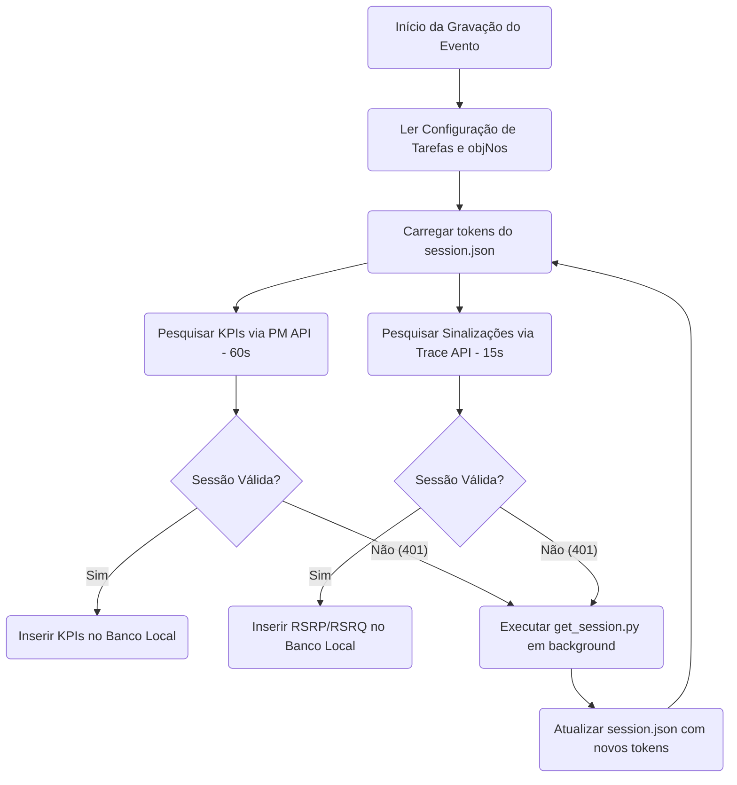

# Plano de Implementação de Coleta HTTP Automatizada (Fase 2)

Este documento descreve o plano de implementação detalhado e as etapas restantes para substituir completamente o processamento de planilhas manuais (`CsvCollector`) pela **coleta direta via requisições HTTP REST no iManager** (`HttpCollector`).

---

## 1. O que já foi Concluído (Fase 1.5)

*   **Automação com Playwright:** O script [get_session.py](file:///c:/Users/a50057663/Desktop/Automa%C3%A7%C3%B5es/SmartEvents/scratch/get_session.py) realiza o login com as credenciais administrativas e navega automaticamente pelas telas do portal.
*   **Captura de Tokens e Cookies:** Ele extrai de forma 100% autônoma o cookie de sessão `bspsession` e o token anti-CSRF `roarand` (lido do `sessionStorage` sob a chave `u2020Showedrand`).
*   **Persistência da Sessão:** A sessão é persistida em formato JSON estruturado no arquivo [session.json](file:///c:/Users/a50057663/Desktop/Automa%C3%A7%C3%B5es/SmartEvents/data/session.json) separando as credenciais de Trace e PM.

---

## 2. O que falta para a Automação 100% Completa?

Para que o monitoramento em tempo real funcione sem intervenção, precisamos implementar as **4 etapas** descritas a seguir.

### Passo A: Configuração de Metadados no JSON do Evento
Precisamos adicionar as configurações de integração do iManager diretamente no arquivo de configuração do evento (ex.: [sample_event.json](file:///c:/Users/a50057663/Desktop/Automa%C3%A7%C3%B5es/SmartEvents/sample_event.json)):

1.  **`trace_task_ids` (lista de ints):** Uma lista de IDs das tarefas de trace de sinalização ativas no iManager, cada uma associada a um VIP (iniciado com `[1925]` correspondente ao VIP Lucas).
2.  **`pm_task_id` (int):** O ID da tarefa de monitoramento de performance no iManager (usaremos o valor `374`).
3.  **`obj_no` por célula (int):** Cada célula nas configurações do site no JSON do evento deve receber o parâmetro `obj_no` que identifica o objeto daquela célula no iManager (para sabermos de quais células puxar KPIs).

*Exemplo de estrutura a ser adicionada ao evento:*
```json
{
  "integration": {
    "trace_task_ids": [1925],
    "pm_task_id": 374
  },
  "sites": [
    {
      "id": "ERB-07",
      "cells": [
        { "id": "ERB-07-Y3500-1", "azimuth": 0, "obj_no": 61696 }
      ]
    }
  ]
}
```

---

### Passo B: Implementar Lógica no `HttpCollector`
Devemos completar os métodos em [core/collector.py](file:///c:/Users/a50057663/Desktop/Automa%C3%A7%C3%B5es/SmartEvents/core/collector.py) na classe `HttpCollector`. O coletor deve ser responsável por:

1.  **Carregar Credenciais:** Ler o arquivo [session.json](file:///c:/Users/a50057663/Desktop/Automa%C3%A7%C3%B5es/SmartEvents/data/session.json) para inicializar a sessão do `requests`.
2.  **Executar Requisições HTTP REST:**
    *   **KPIs:** Fazer `POST` para `/rest/oss/access/pm/v1/monitor/task/result` enviando o payload correspondente às células cadastradas no evento com a tarefa `374`.
    *   **Traces (VIPs):** Para cada ID contido em `trace_task_ids`, fazer `POST` para `/rest/oss/access/fars/v1/traceresult/query/sort` para puxar o log de trace recente. Em seguida, para cada evento RRC de interesse, fazer `GET` em `/msg-explain-info` para puxar os valores decodificados de RSRP/RSRQ.
3.  **Parsers (Tradutores de Resposta):** Converter o JSON retornado pelo iManager em dicionários compatíveis com o banco local (`insert_kpi_batch` e `insert_vip_batch`).

*Exemplo da chamada em Python no coletor:*
```python
import json
import requests

def init_http_session(session_path: str):
    with open(session_path) as f:
        sess_data = json.load(f)
        
    s = requests.Session()
    s.verify = False  # ignora avisos de SSL autoassinado
    s.cookies.set("bspsession", sess_data["monitoring"]["bspsession"])
    s.headers.update({
        "roarand": sess_data["monitoring"]["roarand"],
        "Content-Type": "application/json"
    })
    return s
```

---

### Passo C: Mapear Respostas Reais das APIs
Para concluir o desenvolvimento dos decodificadores (parsers) de resposta, precisamos extrair logs reais das respostas JSON das APIs. 
*   *Precisamos dos retornos de exemplo (Response Payloads)* para ver se os nomes das células vêm escritos de forma legível ou se precisaremos traduzi-los a partir dos códigos `objNo`.
*   *Precisamos do retorno estruturado do Trace* para aplicar o regex correto que decodifica o RSRP/RSRQ do relatório de medição.

---

### Passo D: Sistema de Renovação Automática da Sessão
Como a sessão `bspsession` expira periodicamente no iManager (geralmente a cada 8h ou 24h), a automação completa exige um mecanismo de auto-refresh no scheduler:

1.  Se uma requisição do `HttpCollector` retornar HTTP `401 Unauthorized` ou redirecionar para a tela de login, o coletor emite um alerta e marca a sessão como expirada.
2.  O `scheduler` executa o script `get_session.py` de forma autônoma (em segundo plano):
    ```python
    import subprocess
    subprocess.run([".venv/Scripts/python", "scratch/get_session.py"])
    ```
3.  O script Playwright realiza o login automaticamente e atualiza o `data/session.json` com novos tokens ativos.
4.  O coletor HTTP lê o arquivo novo e retoma a coleta automaticamente, sem interrupções visíveis para o painel SmartEvents!

---

## 3. Fluxo de Execução Recomendado para Integração


